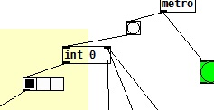

# Max-MSP-Jitter_Gmaj
 My first project written on Max programming language!

<h1>О проекте</h1>
<h2>Для дневника</h2>

<i>23.02.2022</i> я решил заняться музыкой: поиграл на гитаре, опробовал новый её строй, пониженный на целый тон (с E на D) (недавно я впервые в жизни порвал струну и заменил её), а потом вечером занялся программированием музыки. Открыл видео-ролики одного клёвого пацана по имени <b>Тимофей</b>: https://www.youtube.com/watch?v=eL2HaA0S0JQ&list=PL32i_iv4dLiyoksnO-GVAEsFuGddR4RCT — который хорошо, понятно и доступно объясняет основы языка <b>Max</b>. И начал бабахать код на Максе.

Утром около пяти утра у меня получилось сделать свою первую небольшую мелодию (а равно — программу на Max!) из трёх звуков в соль мажоре. Ниже я подробно опишу, о чём вообще я тут говорю вам, дорогой читатель!)

<h2>Содержание</h2>

<ul>
 <li><a href="#theory">Введение в курс дела</a>
  <ul>
   <li><a href="#max">О языке программирования Max</a></li>
   <li><a href="#terms">Об основных понятиях языка</a></li>
  </ul>
 </li>
 <li><a href="#desc">Описание проекта</a></li>
 <li><a href="#litera">Список использованной литературы и источников</a></li>
</ul>

<h2 name="theory">Введение в курс дела</h2>
<h3 name="max">О языке программирования Max</h3>

Это визуальный объектно-ориентированный язык программирования для создания real-time приложений музыкальной направленности и не только (в нём можно обрабатывать видео, изображения и т.д.). Визуальный в том смысле, что объекты, такие как виртуальные осцилляторы, микшеры, разные фильтры звуковых волн, даже объекты обычных целых чисел, арифметических операций и многие другие — эти разнообразные объекты вы расставляете прямо курсором мыши в IDE, не прописывая никакого кода!

То есть Max позволяет нам написать свою музыку, сделать свой электронный музыкальный инструмент и обработать уже готовые аудиозаписи других музыкантов. Кроме этого, с его помощью также можно управлять различными электронными устройствами, построенным на платформе Arduino. То есть возможна связка Arduino и Max.

Говоря «Max», я имею в виду совокупность сразу нескольких разных технологий: <b>Max/MSP/Jitter</b>. <i>«Max – это среда визуального программирования, основа всего; MSP – расширение, делающее возможной работу с аудио, а Jitter – расширение для работы с видео. Отсюда и название – Max/MSP/Jitter»</i> [].

Язык придуман <b>Миллером Паккеттом</b> — американским профессором музыки, директором центра исследования IT и искусства (англ. Center for Research in Computing and the Arts; CRCA). Такие заведения, исследующие музыкальную информатику, появились в США в середине XX-го века и очень хорошо сейчас развиваются. Запад является, можно сказать, лидером в этой области, тогда как российским умам, по словам автора книги «МУЗЫКАЛЬНАЯ ИНФОРМАТИКА В СИСТЕМЕ ПРОФЕССИОНАЛЬНОГО МУЗЫКАЛЬНОГО ОБРАЗОВАНИЯ» Ю. Терентьева, будет ещё над чем поработать в этой отрасли.

Среда программирования Max существует уже более 30-ти лет, и её используют композиторы, исполнители, создатели программного обеспечения и художники для создания своих музыкальных произведений, оформления своих живых выступлений перед публикой и построения художественных инсталляций. Как написано в Вики, кроме того, Max — это модульный язык программирования, имеющий в себе множество отдельных библиотек и модулей программ и предоставляющий богатый API другим людям, заинтересованным в функциональности этой среды. Max написан, к сведению, на C/C++.

<h3 name="terms">Об основных понятиях языка</h3>

Проект этого репозитория будет, хотя бы в целом, ясен и новичкам в програмировании! Объясню вам основные понятия программирования, касающиеся и Макса.

Программисты пишут программы в <b>исходных файлах</b>, которые имеют свой формат в каждом языке программирования:
<ul>
 <li>в Java это файлы <code>.java</code>;</li>
 <li>в C++ это исходники формата <code>.cpp</code>, <code>.h</code> или <code>.c</code>;</li>
 <li>а Python-разработчики скрипты пишут в файлах <code>.py</code>;</li>
</ul>
в Max/MSP/Jitter программы пишутся в файлах, называемых патчами (от англ. patch) и имеющих расширение <code>.pd</code>.

У Max есть как проприетарная версия, так и бесплатная, называемая <b>Pure Data</b>. И именно о ней я сейчас говорю, и она использована в рамках этого репозитория и этой статьи. Эти две разновидности, две стороны одной и той же монеты — вообще ничем не отличаются, кроме графического интерфейса: у оригинального Max, разрабатываемого и продвигаемого фирмой Cycling '74, он более красочный, детальный и насыщенный. У Pure Data, которую сделал и продвинул сам Miller Puckette, интерфейс выглядит намного проще, но, если приглядеться, он такой же понятный и так же чётко отрабатывающий. Если вы пользуетесь и будете пользоваться версией Макса от Cycling '74, то за помощью по конкретным нерешённым для вас вопросам обращайтесь, вы понимаете куда, на их официальный сайт: https://cycling74.com/get-started.

Помимо всего, у каждого языка есть своя документация — у Pure Data она тоже есть (https://puredata.info/docs), в том числе и встроенный обучающий, справочный модуль <i>"help-intro"</i> в IDE (см. <a href="#screen1">скриншот 1</a>).

 <table align="center"><tr><td align="center" ></img></td></tr></table>
Скриншот 1 — Справочное окно в Pure Data
 

В программировании есть такое понятие как <b>объекты</b>. Это некоторая совокупность данных, которую использует ваша программа, ваш патч. Объектом в Pure Data (далее также — PD) (Max) является какое-либо устройство, к примеру генератор колебаний (волн) — тот же осциллятор (<code>osc~</code>), приведённый на <a href="#screen2">скриншоте 2</a> — обычное число или функция <code>print</code>.

 <table align="center"><tr><td align="center" ></img></td></tr></table>
Скриншот 2 — Соединённые между собой объекты в программе PD (Max)
 

<b>Функция</b> в программировании — это определённый вспомогательный блок кода, написанный программистом, который можно использовать неоднократно в основной программе. Так, вышеупомянутая функция <code>print</code> печатает число или какой-нибудь текст в консоли. В Pure Data (Max) функции являются теми же объектами. Функции могут иметь параметры. К примеру функцию <code>print</code> можно написать в Максе так:

 <table align="center"><tr><td align="center" >print</code>" src="img/print.jpg" alt="Параметры функции <code>print</code>"></img></td></tr></table> 

 — с параметром <code>-n</code>, который уберёт префикс, идущий перед самим выводом, из консоли.

В Pure Data (Max) большинство объектов имеет <b>входы</b> и <b>выходы</b>. На входы подаётся число или просто какой-нибудь сигнал, и после их обработки создаются выходные данные, то есть те же, изменённые определённым образом, число или сигнал, которые в конце подаются на выход. Иными словами, объекты в PD (Max) могут соединяться друг с другом, причём один из объектов присоединяет свой вход к выходу другого объекта. После этого они смогут взаимодействовать. На <a href="#screen3">скриншоте 3</a> ниже представлен простейший патч с операцией сложения <code>+</code>, на входы которой подаются два объекта-числа и выход которой идёт в функцию <code>print</code>, которая распечатывает в консоли Pure Data результирующее значение.

 <table align="center"><tr><td align="center" ></img></td></tr></table>
Скриншот 3 — Взаимодействие объектов в простейшей программе (PD-патче)
 

Также нужно сказать, что один из входов объекта — правый — называют <b>холодным</b>, а второй — левый — <b>горячим</b>. Это из-за того, что при изменении только левого, горячего входа, к примеру числа в <a href="#screen3">примере выше</a>, выдастся результат операции. Но при изменении правого числа операции <code>+</code> ничего не произойдёт, операция не будет вычисляться. Для этого нужно поменять число на левом входе. Или же просто нажать на <b>кнопку</b> у этого же числа (см. эту кнопку в том же <a href="#screen3">примере</a>).

Эта кнопка называется <code>Bang</code>, она посылает сигнал "запустить" к другому объекту, к которому подсоединена, при нажатии на неё или активации уже её входа.
 Так вот если нажать эту кнопку, как на <a href="#screen3">скришоте 3</a>, у левого входа операции <code>+</code>, то она посчитает сумму. А если нажать её, подсоединив к правому входу <code>+</code>, то ничего не заработает, и придётся менять число на левом входе или же ставить вторую кнопку уже на этом горячем входе.

Это самый минимум, которым я с вами делюсь, дорогой читатель. Но в нём изложена база для вашего более глубокого понимания Макса!

<h2 name="desc">Описание проекта</h2>

В папке <i>"video"</i> этого репозитория есть заснятый результат работы моего самого первого полного и рабочего PD-патча. В патче применяются объекты:
<ul>
 <li><code>number</code>, числа (двух видов): хранят в себе целочисленные значения. Кроме этого, если подать на вход таких объектов дробное число (объект <code>float</code>), то оно округлится, просто отбросив десятичную часть;</li>
 <li><code>toggle button</code>: объект, при активации которого (нажатием мышью или подачей ненулевого сигнала на вход) он выдаёт на выходе единицу, а при выключении (повторным нажатием мышью или подачей ненулевого сигнала на вход) — ноль;</li>
 <li><code>metro</code>: метроном программы, который периодически выдаёт сигнал через равные промежутки времени и который можно настроить с помощью ещё одного объекта — <code>tempo</code> (подробнее про них см. справку по Max или Pure Data);</li>
 <li><code>horizontal radio button</code>: объект, значения которого строго заданы (в этом проекте, как вы можете увидеть из скриншота <i>"visual program.jpg"</i>, таких значений у него трое — это номера играющих звуков (пронумерованных с нуля: <b>G=0</b>, <b>B=1</b>, <b>D=2</b>, и затем играется всё заново, в цикле) (см. внешний вид этого объекта ниже);</li>
 <li><code>select</code>, который по сигналу на входе выдаёт сигнал на соответствующем по порядку выходе: к примеру, если на входе ноль, то <code>select</code> подаст сигнал на свой первый выход, который активирует кнопку, которая, в свою очередь, подаст ноту G с частотой 932 Гц на вход осциллятору и укажет единицу (— номер ноты B) в качестве следующей ноты (см. внешний вид этого объекта ниже);</li>
 <li>также есть в патче и <b>переменная</b>, которая имеет традиционное для программирования предназначение: хранение какого-либо значения. В этой программе репозитория она хранит в себе целые числа — а именно номера нот по очереди, сначала номер одной, потом номер следующей ноты и т.д. (см. внешний вид этого объекта ниже);</li>
 <li>осциллятор <code>osc~</code> и микшер <code>output~</code>), первый из которых генерирует колебания с заданной частотой нужной ноты и направляети их на микшер, а второй просто выдаёт (играет) получившийся звук (т.е. эти сгенерированные осциллятором колебания).</li>
</ul>

<table align="center">
 <tr>
  <td align="center"></img></td>
 </tr>
 <tr>
  <td align="center"></img></td>
 </tr>
 <tr>
  <td align="center"></img></td>
 </tr>
</table>
 

<b>На этом всё, дорогой читатель. Большое спасибо тебе за то, что прочёл эти строки, и молодец, что поинтересовался такими вещами!) Если что пиши мне в Вк :) буду рад поговорить!

Успехов тебе, друг!!</b>

<h2 name="litera">Список использованной литературы и источников</h2>
